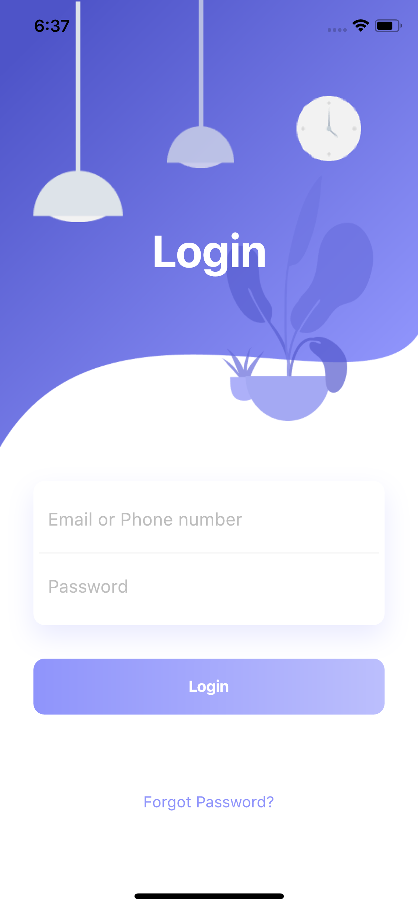

# Flutter Beautiful Login Page UI Design and Animation

Flutter Beautiful Login Page UI Design and Animation - day 12 Flutter Animation and UI Design.

This repository is a part of the 100-day design in Flutter.

In this video we use, Flutter Animation, Fade, Stack, Positioned, BoxShadow, TextField, Gradient, LinearGradient and so on in the one-speed video.

[Youtube Video](https://youtu.be/NHAIiAmxTAU)

## Last Design
- [UI Design- Day 1](https://github.com/afgprogrammer/flutter-inspiration-app-ui)
- [UI Design- Day 2](https://github.com/afgprogrammer/Flutter-trip-app-ui)
- [UI Design- Day 3](https://github.com/afgprogrammer/Flutter-food-delivery-app-ui)
- [UI Design- Day 4](https://github.com/afgprogrammer/Flutter-actors-profile-app-ui)
- [UI Design- Day 5](https://github.com/afgprogrammer/Flutter-ripple-map-application)
- [UI Design- Day 6](https://github.com/afgprogrammer/Flutter-page-transition-animation)
- [UI Design- Day 7](https://github.com/afgprogrammer/Flutter-button-animation)
- [UI Design- Day 8](https://github.com/afgprogrammer/Flutter-Splash-Screen-Animation)
- [UI Design- Day 9](https://github.com/afgprogrammer/Flutter-Party-Event-Application)
- [UI Design- Day 10](https://github.com/afgprogrammer/Flutter-GridView-Example-UI)
- [UI Design- Day 11](https://github.com/afgprogrammer/Flutter-Travel-Application)

## ScreenShot

